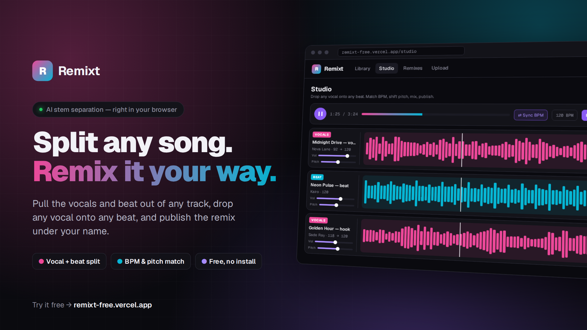

# Remixt

[](remixt-ad-16x9.mp4)

**[Try it free → remixt-free.vercel.app](https://remixt-free.vercel.app)** · [▶ Watch the 16-second video](remixt-ad-16x9.mp4)

A browser-based DAW for remixing songs: upload a track, it's automatically
split into a vocal stem and a beat (instrumental) stem, both land in a
shared library, and the Studio lets you pull any vocal onto any beat, match
their BPMs, adjust pitch, mix levels, and publish the result as a remix
under your artist name.

Songs are split **in the browser** — the same Demucs model the project
used to run in Python, exported to ONNX and run with ONNX Runtime Web
(WebGPU where available, WebAssembly otherwise). The server never touches
an AI model, which is what lets the whole thing run on free hosting.

## Architecture

- **`web/`** — Next.js (TypeScript) app: auth, upload, library, the Studio
  DAW UI (Web Audio API + SoundTouch for pitch/tempo), remix gallery, artist
  profiles, and the in-browser song splitter.
- **Postgres** — accounts, tracks, stems, remixes. Local Docker container
  in development; Neon (or the one inside the Docker image) when deployed.
- **Stem storage** — Vercel Blob when `BLOB_READ_WRITE_TOKEN` is set,
  Cloudflare R2 when `R2_*` is, otherwise local disk under
  `storage/stems/<track-id>/` (gitignored).
- **`separation-service/`** — the old Python/Demucs splitter. Nothing uses
  it any more; it's kept only for reference and can be deleted.

Upload flow, all in the browser tab:

1. The file is decoded and resampled to 44.1 kHz (`lib/client/splitter.ts`).
2. A Web Worker (`lib/client/splitter.worker.ts`) runs Demucs, sums
   drums + bass + other into the beat, encodes both stems to 192 kbps MP3,
   and computes waveform peaks and the BPM.
3. `POST /api/tracks` creates the track and returns an upload URL per stem
   — a signed R2 URL, or `PUT /api/tracks/<id>/stems/<kind>` locally.
4. The browser uploads both MP3s, then `POST /api/tracks/<id>/complete`
   checks they're there and marks the track ready.

The original song never leaves the user's device. The model (~172 MB) and
ONNX Runtime (~28 MB) download once — a signed-in user's browser starts
fetching them on any page, with a progress pill in the corner — and are
kept in Cache Storage, so later visits load them from disk. Playback goes
through `/api/audio/stem/<id>`: a redirect to R2's public URL, or a
Range-capable stream from disk.

Pages are served cross-origin isolated (COOP `same-origin`, COEP
`credentialless`, in `next.config.ts`) so the WebAssembly fallback can use
every CPU core.

## Deploying it

Free on Vercel (with Neon and Vercel Blob, all from Vercel's dashboard),
or as one Docker image on any server — step by step in [DEPLOY.md](DEPLOY.md).

## Running it

You need Docker (for Postgres) and Node 20+.

```bash
./start-dev.sh
```

That starts the Postgres container (creating it and applying the schema on
first run) and the Next.js app on `:3000`. Open http://localhost:3000.

To run the pieces separately instead:

```bash
docker start remixt-test-pg      # Postgres on :5433
cd web && npm run dev            # Next.js app on :3000
```

If the database container doesn't exist yet, `start-dev.sh` creates it and
runs the schema. To do it by hand:

```bash
docker run -d --name remixt-test-pg -e POSTGRES_PASSWORD=devpassword \
  -e POSTGRES_DB=remixt -p 5433:5432 postgres:16-alpine
cd web && node scripts/migrate.mjs
```

### Configuration

`web/.env.local` holds everything:

| Variable | Meaning |
| --- | --- |
| `DATABASE_URL` | Postgres connection string |
| `SESSION_SECRET` | signs session cookies (and, unless `AI_KEY_SECRET` is set, encrypts users' AI keys) |
| `AI_KEY_SECRET` | optional: its own secret for encrypting users' ChatGPT/Claude keys. Changing it (or `SESSION_SECRET` without it) makes saved keys unreadable — users re-enter them |
| `STORAGE_DIR` | where stems go when R2 isn't configured (`../storage`) |
| `BLOB_READ_WRITE_TOKEN` | store stems in Vercel Blob (Vercel sets it when a Blob store is connected) |
| `R2_ACCOUNT_ID`, `R2_ACCESS_KEY_ID`, `R2_SECRET_ACCESS_KEY`, `R2_BUCKET`, `R2_PUBLIC_URL` | store stems in Cloudflare R2 instead (see DEPLOY.md) |
| `NEXT_PUBLIC_STEM_BITRATE` | MP3 bitrate of the stems, kbit/s (default 192; 128 saves ~30% space) |
| `NEXT_PUBLIC_DEMUCS_MODEL_URL` | where browsers download the model (default: Hugging Face) |
| `NEXT_PUBLIC_ORT_BASE_URL` | where browsers load ONNX Runtime from (default: `/ort/`, copied from `node_modules` before dev/build) |

## The Studio

Everything below the transport is a project on one timeline, measured
against a project tempo you set (type it, or tap it in).

- **Timing** — each lane has its own start position on the timeline. Drag
  the clip, nudge it by a beat or a bar, or drop it at the playhead; with
  Snap on, drags move in whole beats. Moving a clip while the transport
  runs is heard immediately — no need to pause and play again.
- **Tempo & key** — per-lane BPM (editable, since detection sometimes
  halves or doubles), "Match" to stretch one lane to the project tempo,
  "Match all lanes" for the whole project, plus pitch in semitones and a
  free speed control.
- **Key** — each lane's key is detected in the browser when it's added
  (shown as e.g. "A min · 8A" with its Camelot code, and editable), and
  "Match" / "Match keys" pitch-shifts lanes onto the project key — the
  key of the first beat lane. Relative major/minor count as a match.
- **✨ AI Match** — listens to every lane once and fits them together,
  without ever changing pitch (keys are only reported; the lane's Key →
  Match shifts one if you want). It sharpens each BPM against the song's
  real hits, locks tempo to the beat (reading a vocal as half/double time
  when that needs less stretching), puts the beat's downbeats on the bar
  lines, then **arranges each vocal phrase by phrase**: the vocal is cut
  at its silences (which also drops the original song's bleed between
  lines), and every phrase is placed on the matching bar of the beat at
  the same spot in the bar it was sung, re-locked to the beat's actual
  hits so live or drifting recordings stay together. It comes in after
  the beat's intro, keeps the original song's spacing, shortens long
  instrumental breaks, and leaves out sections that run past the end of
  the beat. The vocal's bar lines come from its original beat stem (the
  other half of its song, via `/api/stems/<id>/partner`); without it,
  each section is kept as sung and slid onto the beat by its syllables.
  Levels and a starting FX chain round it off. It lists every change and
  can be undone. It's signal analysis (`web/src/lib/client/analysis.ts`,
  `arrange.ts`), not a remote model — nothing leaves the browser.
  Each phrase is also stretched a little (up to 8%, pitch unchanged) to
  follow a beat whose tempo drifts, long unbroken phrases are cut at a
  breath every couple of bars so they stay locked too, and the report
  warns when it couldn't tell which beat is the "one" (the lane's ±½bar
  nudges fix that in one click).
- **✨ AI producer** — a chat in the Studio's sidebar (and a ✨ AI
  button on every lane that drafts a request for it) where the user's own
  model — Claude or ChatGPT — edits the open remix. Each user saves their
  API key in AI settings; it's stored in their account encrypted with
  AES-256-GCM (`user_ai_settings`, `lib/aiKeys.ts`) and never sent back to
  the browser. `/api/ai/chat` makes one model call per turn with that key;
  the browser runs the loop, carrying out the model's tool calls on the
  live project (`lib/client/aiAgent.ts`) and sending back the results
  until it's done. The tools (`lib/aiTools.ts`) let it read the project,
  hear a vocal/beat pair through the studio's analysis (it can't hear
  audio: it gets tempos, keys, the beat's bars with a loudness digit per
  bar, its intro, level changes and ending, and the vocal in ~8-bar
  sections with which ones repeat), arrange a vocal section by section on
  the beat (`lib/client/aiMatch.ts`, through the same engine as AI Match),
  run AI Match, set levels and effects, move lanes, split/move/delete/
  duplicate clips, cut silences and set a loop. It never changes pitch.
  Every turn can be undone in one click.
- **Editing** — a lane can be cut into clips: split at the playhead, "cut
  silences" (every phrase becomes a clip, left where it was), drag a clip
  to move it, drag its edges to trim, duplicate or delete the selected
  clip, and "whole take" to go back to the uncut stem. Arrangements are
  saved with the remix.
- **Mixing** — volume, mute, solo, pan, stereo width, a 3-band EQ, high-
  and low-pass filters, saturation, fades in/out, and a master fader that
  runs into a safety limiter.
- **Effects** — per-lane reverb (adjustable room size) and a delay that
  locks to the project tempo (1/2 through 1/16, dotted included), with
  feedback. One-click presets per lane type: Air, Hall, Slapback, Dub
  throw, Radio and Wide double for vocals; Punch, Lo-fi and Underbed for
  beats. Vocal presets also switch on a levelling compressor and a
  high-pass, which is what a raw separated vocal usually needs.
- **Transport** — play/pause (space), stop (Esc), a loop region you drag
  across the ruler (L toggles it), and a metronome click.
- **Export** — "Export WAV" bounces the project through the same graph you
  just heard into a 16-bit stereo WAV, including the reverb/delay tails;
  with a loop set you can export just that region, and each lane has its
  own export button for pulling out a single treated acapella or beat.

Previews (the ▶ buttons in the library) all run through one shared player,
so only one thing plays at a time and the bar along the bottom of the
window always has a stop button for it.

## Notes

- Splitting speed depends on the visitor's device: about 1–2 minutes per
  song with WebGPU, several minutes on the CPU. A track whose upload never
  finishes (tab closed mid-way) is swept to "failed" after 20 minutes.
- `web/.npmrc` points npm's cache at a project-local folder — this repo's
  dev environment had a permissions issue with the global npm cache; this
  sidesteps it and isn't required elsewhere.
- Sessions are a signed JWT in an HTTP-only cookie.
- Songs can be up to 15 minutes; any format the browser can decode (mp3,
  wav, m4a, flac, ogg, aac in current browsers).
- Remix lanes persist their effect rack and BPM override in
  `remix_lanes.settings_json`, and the project tempo, master level and loop
  region live in `remixes.project_json` — JSON columns so the mixer can
  grow without a migration per knob. Older remixes fall back to defaults.
- Pitch and BPM-matching run client-side (SoundTouch, offline-rendered —
  not a live audio-worklet) — changing a lane's pitch or tempo re-renders
  that stem's buffer once, like a DAW "freeze" operation, then plays back
  normally. Keeps multi-lane sync simple.

ali